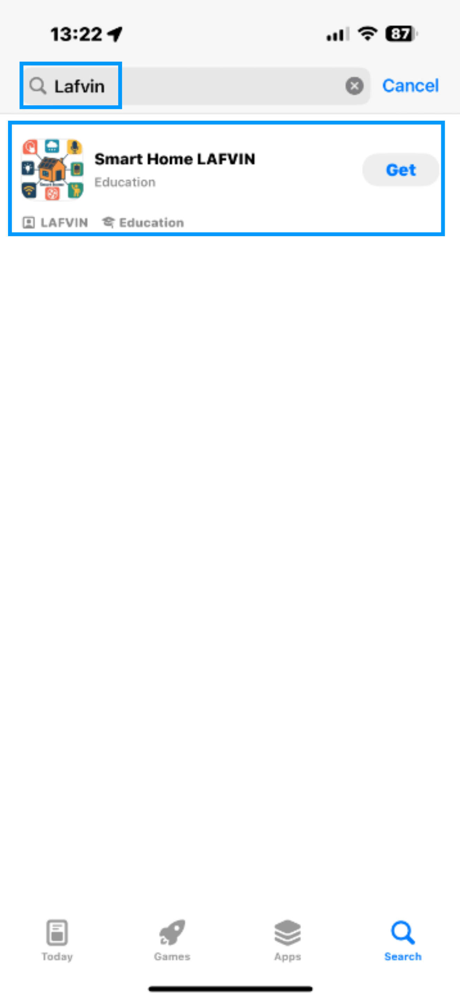
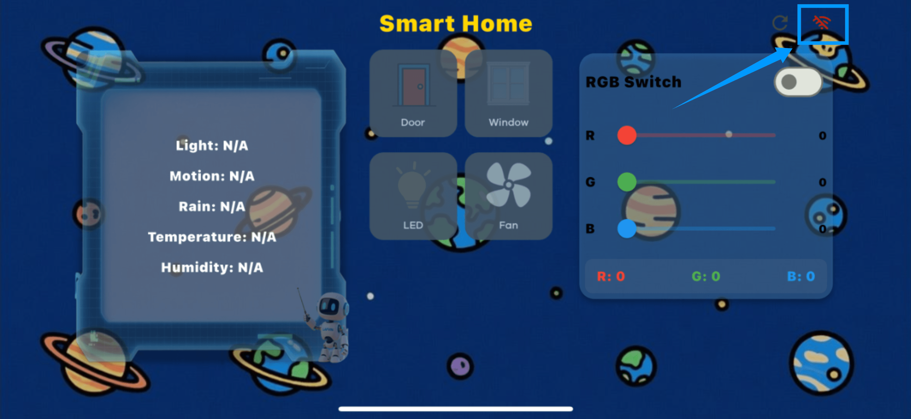
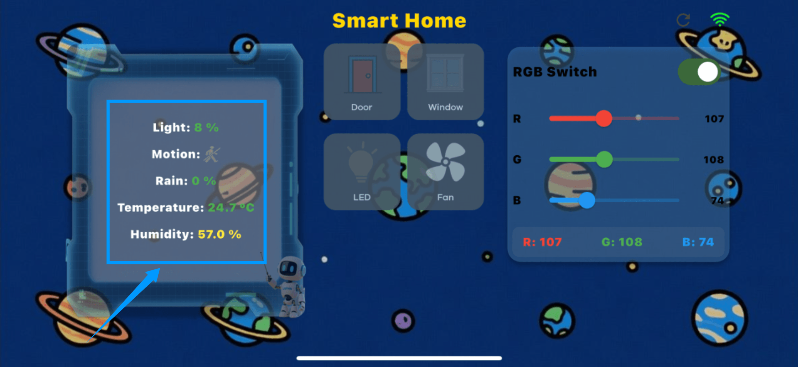
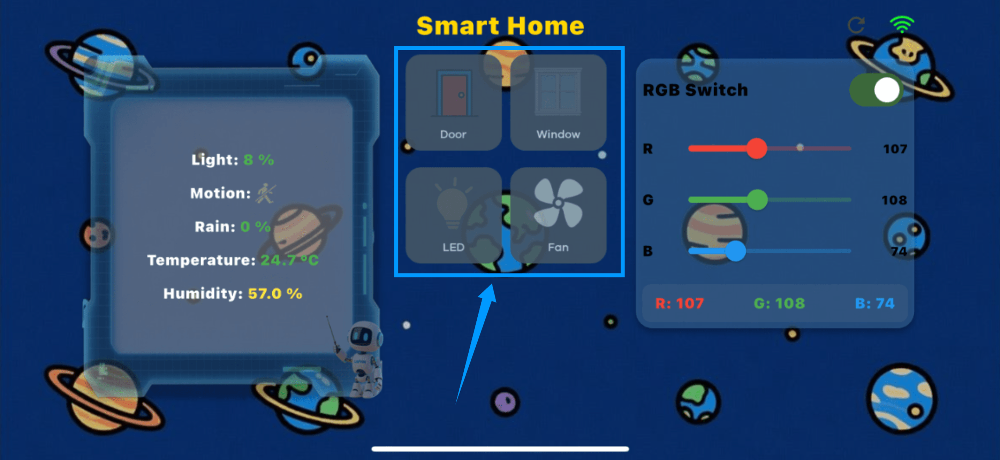
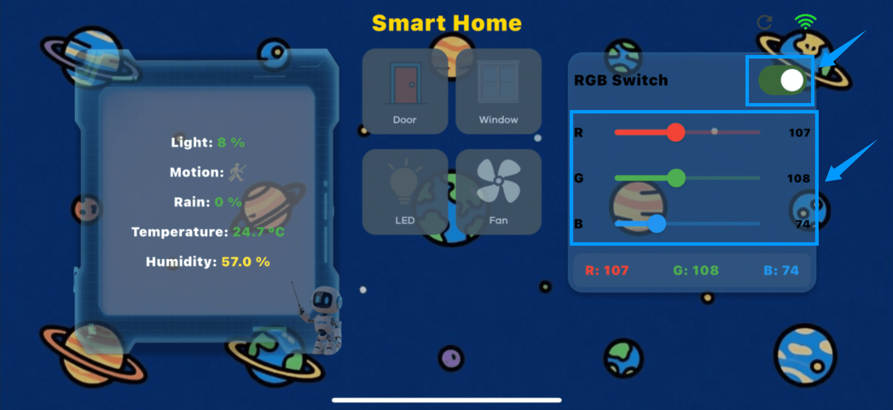

APP Download And Speech Recognition Operation
=============================================

- This kit enables remote monitoring and operation via a mobile app (supporting iOS and Android). After downloading and installing, users can view real-time sensor data (temperature, humidity, light intensity, rain, and motion detection), and control all the components in the kit (doors, windows, lights, fans, RGB light strips, etc.). The user interface is simple and intuitive, making it easy to get started quickly.
- In addition, the kit supports voice recognition control, allowing users to turn the lights, fans, and RGB light strips on and off, and adjust the volume, providing a more convenient user-computer interaction experience.

APP Download
------------

- Android phones can download it by clicking this link and follow the phone's prompts to complete the installation.  
  `APP Download <https://www.dropbox.com/scl/fi/j6oue7pij59qyy9cwqclh/CH34x_Install_Windows_v3_4.zip?rlkey=xttzwik1qp56naxw8v7ostmkq&e=1&st=kcy0xjl1&dl=0>`_

- iOS devices can download the app from the App Store. Search for "LAFVIN" to find and install it, or scan the QR code below to jump to the download page.  

APP Usage Guide
---------------

1. Open the downloaded and installed application, the interface is as follows.  

.. image:: _static/53.APP.png
   :width: 600
   :align: center

2. Click the WiFi icon in the upper right corner of the interface, enter the IP address, and then click the "Connect" button to successfully connect the mobile app to the kit.  

.. raw:: html

   

.. image:: _static/54.APP.png
   :width: 600
   :align: center

.. note::

   - The kit's IP address will be displayed on the LCD1602 screen each time the development board is powered on. Because the IP address may change randomly, if your mobile app cannot connect to the kit, first confirm whether the IP address has changed and enter the latest address to connect.
   - If you receive a "Connection failed" message when trying to connect to an IP address on iOS, first go to System Settings, find the "Wi-Fi & Cellular Data" permission for the app, and confirm that Internet access is enabled. If not, enable the permission, then return to the app and try connecting again.  

   .. image:: _static/56.APP.jpg
      :width: 600
      :align: center

3. APP Interface Operation Guide

- Once connected, users can control the Smart Cabin Kit through the app. The left side of the interface displays real-time sensor data, including temperature, humidity, brightness, rain levels, and human presence, allowing users to monitor environmental conditions at any time.  

- The middle is the control area. Click different icons to switch on and off the LED lights, fans, doors and windows. The operation is intuitive and convenient.  

- On the right is the RGB atmosphere light control area. In addition to switching preset lighting effects through the button module, you can also manually adjust the RGB values ​​in the APP to customize your favorite colors. However, you must first click the "RGB Switch" button to turn on the light strip before you can adjust the color.  

Speech Recognition Operation
----------------------------

This kit supports voice recognition, allowing users to directly control LED lights, fans, doors and windows, and adjust the volume through voice commands.  

- close the door
- Turn on the light
- Turn off the light
- Open the window
- close the window
- Turn on the fan
- Turn off the fan
- Turn on the ambient light
- Turn off the ambient light
- Volume Up
- lower the volume

.. note::

   - The system only recognizes the following preset commands. Voice content outside the range will not take effect.