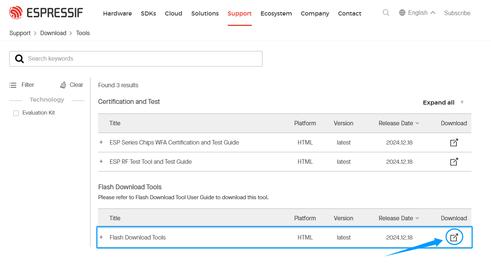
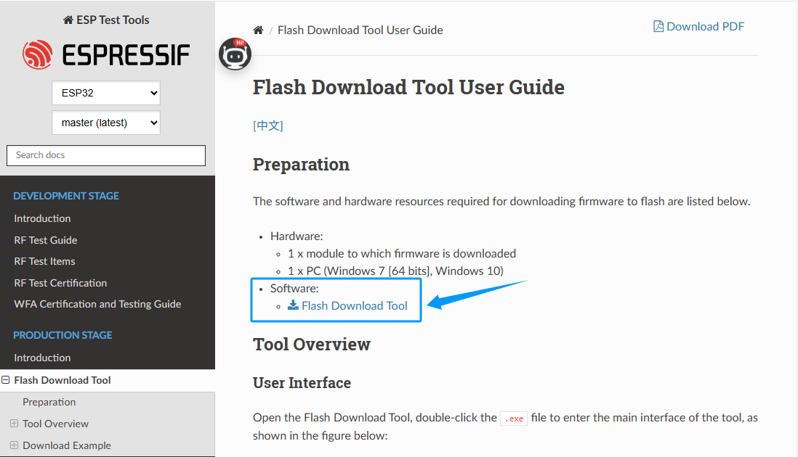
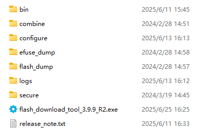
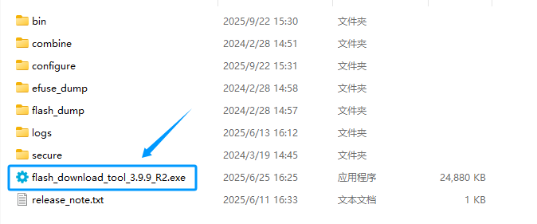
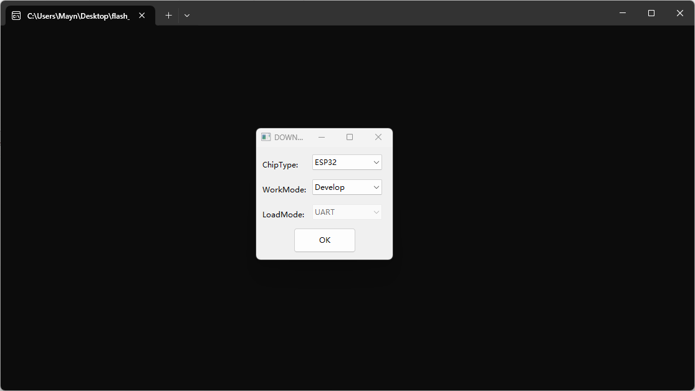
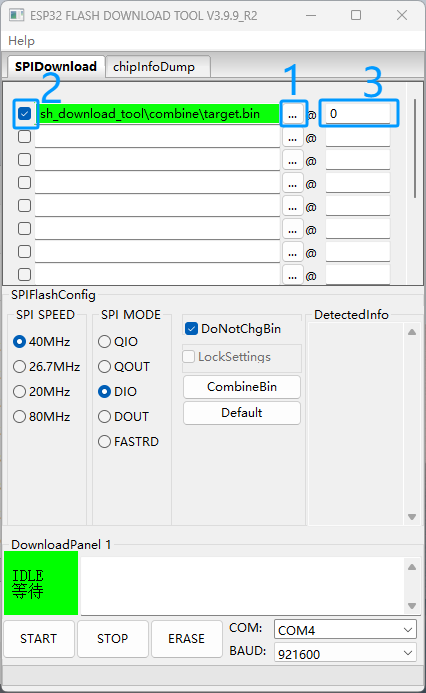
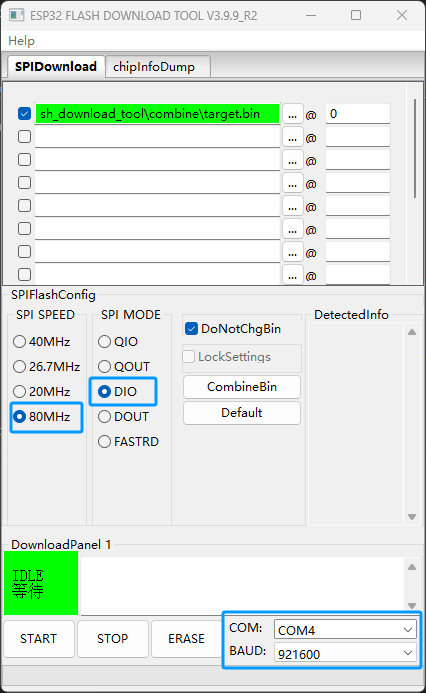
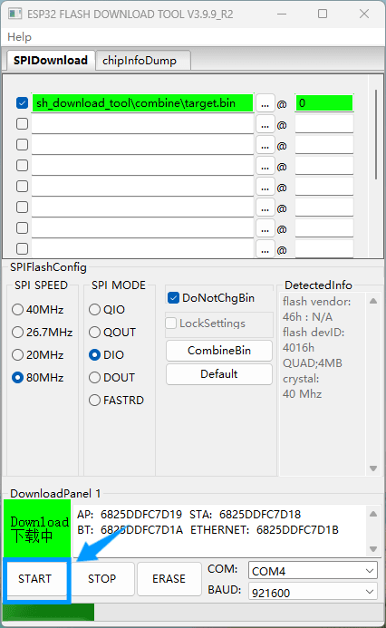
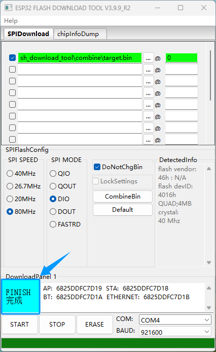

Direct Burning Program
======================

- Of course, if you find the above steps too cumbersome, you can also use Espressif's official flashing tool. We've packaged the program as a bin file, so you can flash it directly to the ESP32 development board without importing libraries or downloading the ESP32 core package, allowing you to experience the kit's features more quickly.

Install CH340 Driver
--------------------

- Similarly, before using Espressif's official flashing tool, you must first install the CH340 driver so that the ESP32 development board can communicate properly with your computer. If the CH340 driver is not installed, please see the CH340 driver installation tutorial page: :doc:`install_CH340`.

Download burning tools
----------------------

1. Click this link to enter Espressif's official burning tool download page.  
   `Espressif Burning Tool <https://www.arduino.cc/en/software/>`_

2. Click the Download button in the image to automatically download Espressif's official programming tool. The tool's features and instructions are also provided at the bottom of the page. If you're interested, please read and learn more.

3. After decompressing the downloaded compressed file, you will see several files contained in it, as shown in the figure below.

4. Click this link to download the bin firmware file we prepared for you.  
   `Download firmware <https://www.dropbox.com/scl/fi/j6oue7pij59qyy9cwqclh/CH34x_Install_Windows_v3_4.zip?rlkey=xttzwik1qp56naxw8v7ostmkq&e=1&st=kcy0xjl1&dl=0>`_

5. Move the downloaded bin firmware file to the bin folder in the previously downloaded and unzipped burning tool directory.

Burning firmware
----------------

1. Connect the ESP32 development board to the computer via a USB cable and make sure the computer can correctly identify the corresponding serial port.

2. Double-click to open the burning tool.

3. On the pop-up page, select **ESP32** from the "Chip Type" drop-down menu, select **Develop** from the "WorkMode" drop-down menu, and leave **UART** as the default setting for "LoadMode". Click **OK** when finished.

.. raw:: html

   

4. Follow the instructions in the picture to import the downloaded firmware (the file has been moved to the bin folder). Select the firmware file in the box on the left side of the software interface and enter "0" in the box on the right to complete the firmware setting.

.. raw:: html

   

5. Set the parameters as shown in the picture: **SPI SPEED** select **80MHz**, **SPI MODE** select **DIO**, **COM** select the serial port actually connected to the computer, and **BAUD** set to **921600**.

.. raw:: html

   

6. After completing the above settings, click the **START** button and the system will automatically start burning the firmware. Please wait patiently for the burning to complete.

.. raw:: html

   

7. After the burning is completed, the interface will display the **FINISH** prompt. At this time, press the RST reset button on the ESP32 development board and the system will start running.

.. raw:: html

   

.. note::

   If the flashing process fails, please follow these steps:

   - Confirm that the ESP32 development board is properly connected to the computer via a USB cable and that the CH340 driver is installed.
   - Check that COMx in the flashing tool is the actual serial port number.
   - Confirm that the firmware file is correctly placed in the BIN folder and check the box on the left.
   - Verify the flashing parameter settings: SPI SPEED = 80MHz, SPI MODE = DIO, BAUD = 921600.
   - Try changing the USB cable or USB port to eliminate communication issues.
   - If flashing still fails, restart the computer and development board and try again.