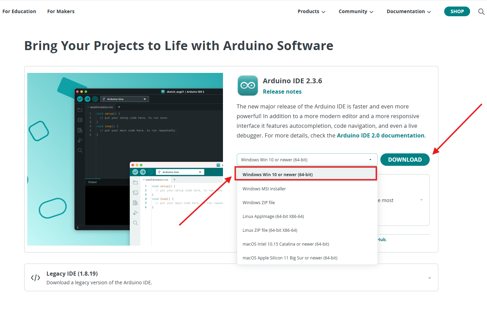

Installing the Arduino IDE
===========================

Install Arduino IDE Fro Windows
---------------------------

 - 1.Visit the official website of Arduino IDE `Arduino IDE tutorial <https://www.arduino.cc/en/software/>`_

 - 2.Please select the version that matches your computer configuration to download. Click the 'Download' button to automatically start downloading.

.. admonition:: Precautions
 - The Arduino IDE version will be updated over time. To ensure compatibility with the system, it is recommended that you choose the latest official version when downloading.

 - 3.Double click the ``arduino-ide_xxxx.exe`` file to run the downloaded file.
 - Read the License Agreement and agree it.

   .. image:: _static/Install_Arduino_IDE_2.png

 - 4.Choose installation options.

   .. image:: _static/Install_Arduino_IDE_3.png

 - 5.Choose install location. It is recommended that the software be installed on a drive other than the system drive.

   .. image:: _static/Install_Arduino_IDE_4.png

 - 6.Then Finish. 

   .. image:: _static/Install_Arduino_IDE_5.png