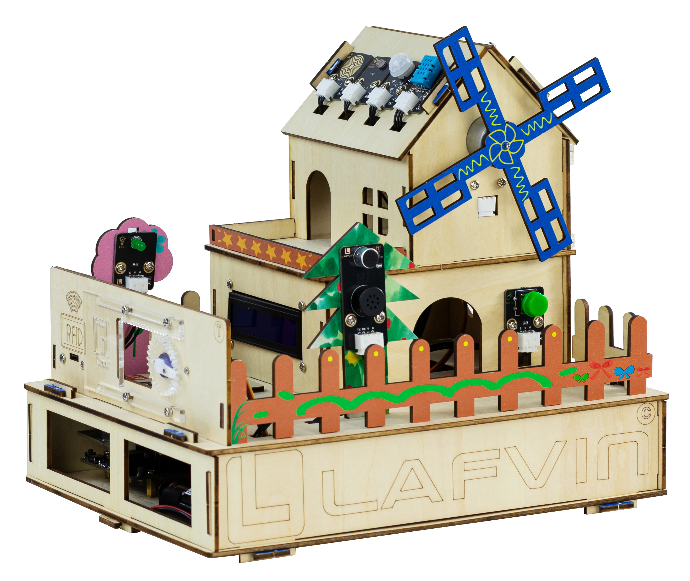

Introduction
============

Welcome to **ESP32-IOT-SmartHome-kit**!  

To help you get started quickly and reduce possible problems during use, we recommend that you **read this tutorial carefully** before following the installation steps.

Bill of Materials
-----------------

The following table lists all components included in the **ESP32-IOT-SmartHome-kit**. Please check carefully to ensure that all parts are complete before starting.  

.. list-table::
   :header-rows: 1
   :widths: 50 20

   * - Item
     - Quantity
   * - ESP32 DevKit
     - 1 pcs
   * - ESP32 Expansion Board
     - 1 pcs
   * - Battery Box
     - 1 pcs
   * - DHT11 Sensor
     - 1 pcs
   * - PIR Sensor
     - 1 pcs
   * - Raindrop Sensor
     - 1 pcs
   * - Light Sensor
     - 1 pcs
   * - LED Module
     - 1 pcs
   * - Button Module
     - 1 pcs
   * - Motor Fan Module
     - 1 pcs
   * - Speech Recognition Module
     - 1 pcs
   * - RGB Light Strip
     - 1 pcs
   * - LCD1602 Display
     - 1 pcs
   * - RFID Module + IC Card
     - 1 set
   * - SG90 Servo
     - 2 pcs
   * - Type-C Data Cable
     - 1 pcs
   * - 3P Cable
     - 9 pcs
   * - 4P Cable
     - 4 pcs
   * - Basswood Board
     - 1 set
   * - Painted Basswood
     - 1 pcs    
   * - Gasket
     - 12 pcs  
   * - Phillips Screwdriver
     - 1 pcs
   * - Screw Bag
     - 1 bag
   * - Acrylic Sheet
     - 1 set
   * - Glue
     - 5 pcs

Installation Tutorial
---------------------

To help you assemble the kit, please refer to the following resources:  

1. **Video Tutorial**  
   Watch the full demonstration video to learn step-by-step installation.  

2. **Graphic Tutorial**  
   For detailed wiring and assembly diagrams, please refer to the online tutorial:  
   `Installation Graphic Tutorial <https://lafvin-smart-home.readthedocs.io/en/latest/index.html>`_  

.. note::

   - It is recommended to prepare all components in advance before starting the installation.  
   - Follow the video first, then check the graphic tutorial for wiring details.  

.. important::

   If you'd like to quickly experience the kit's features, click here to jump directly to a tutorial on flashing the firmware.  
   Flashing the firmware directly to the ESP32 development board will allow you to immediately experience the kit's full functionality.  

   For a step-by-step guide to installation and configuration, please follow this tutorial:  
   :doc:`Direct_burning_program`