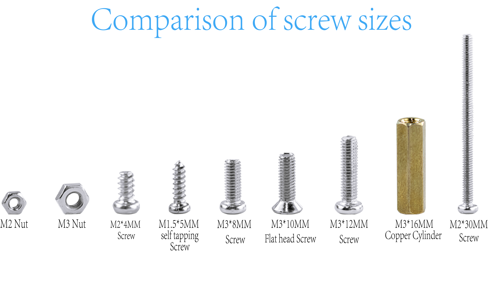

Installation Tutorial of Smart Home 
===========================
（此处图片可换为实拍图）

.. figure:: _static/1.completed.png
   :alt: The effect picture of the cabin installation
   :align: center

   （Design sketch of smart house installation）

Introduction
------------
  This tutorial is for installing the "LA-Smart-Home" smart home. To ensure an efficient and error-free installation, please carefully read all steps and precautions before installation.

Installation video tutorial
-----------
（此处会插入一段安装的视频教程）

Screw size comparison
------------
 - This product requires several different screw types during installation. Before installation, please verify each screw type and follow the instructions in this tutorial to use the specified screw type.
 - Mixing or substituting screw types is strictly prohibited. This may cause installation failure or damage to the product due to screw mismatches. If you are unable to identify the screw type, please discontinue operation and refer to the accessories list or contact customer service for confirmation.

*Now, please follow the steps in this tutorial and let’s start installing the "LA-Smart-Home" smart home cabin.*
