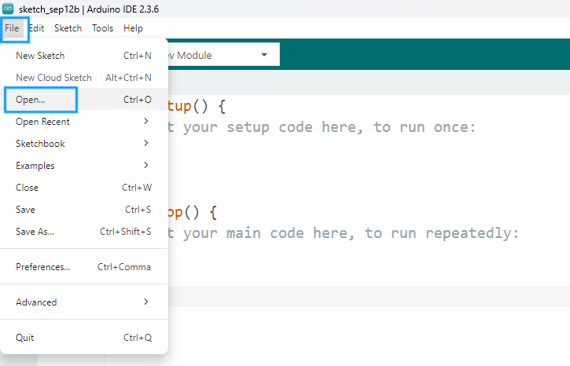
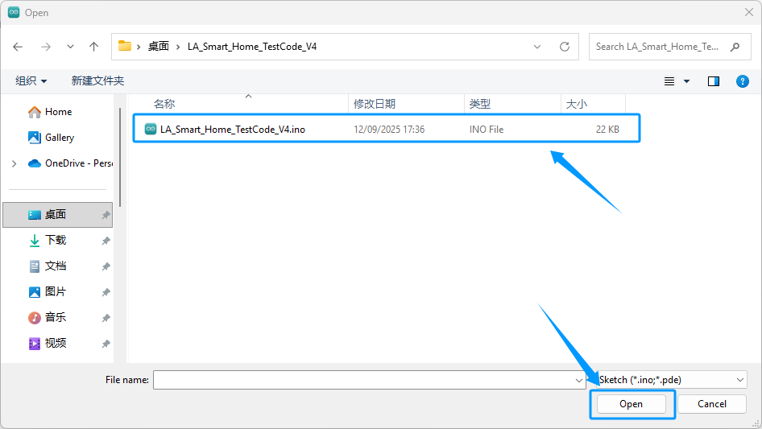
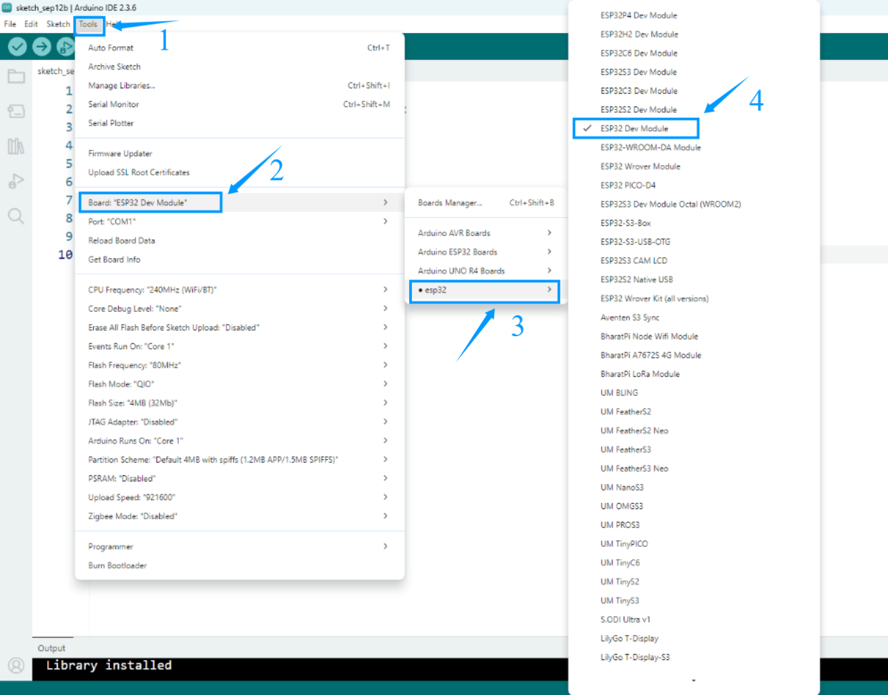
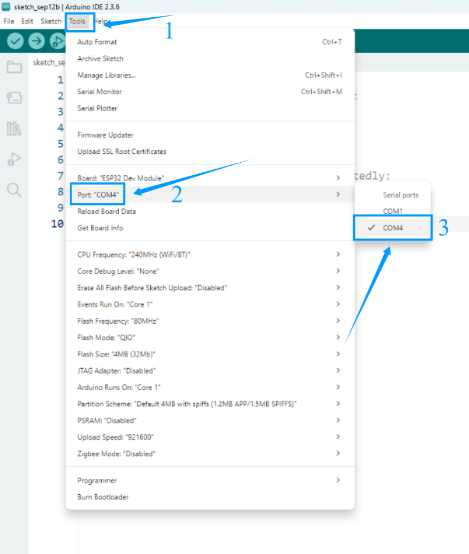
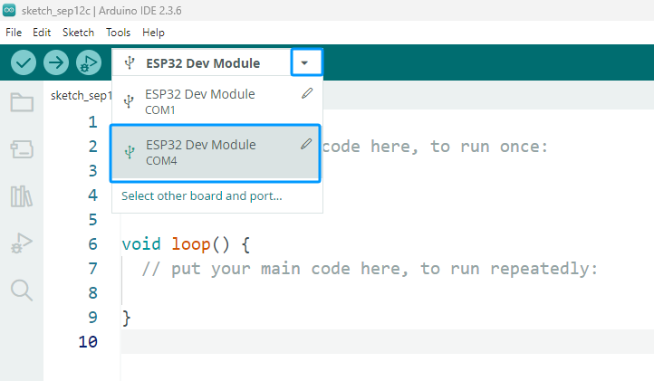
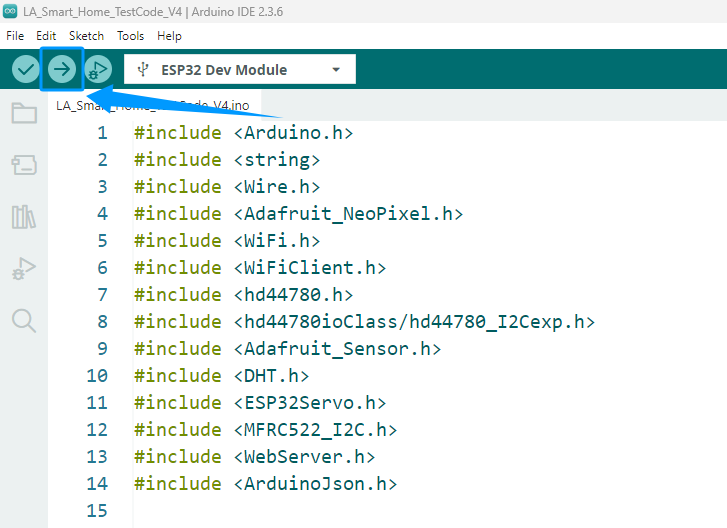
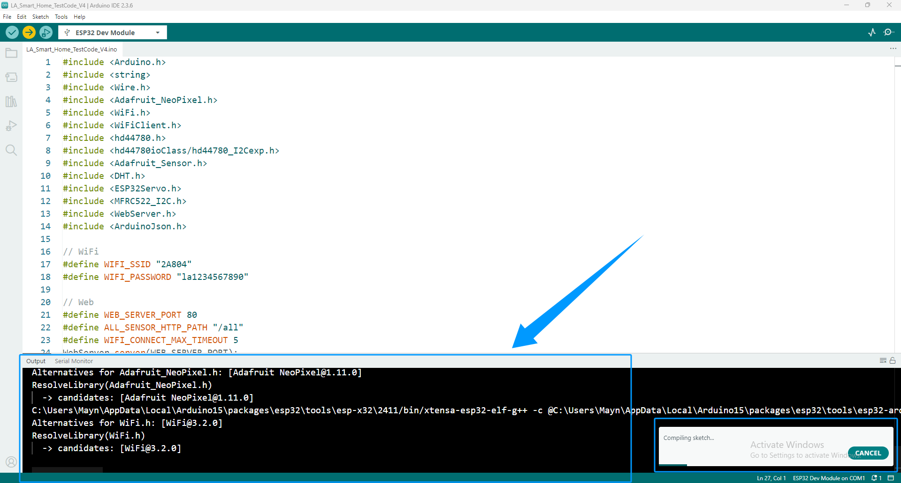
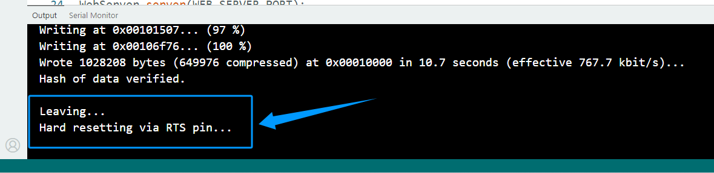

Upload Code To ESP32
====================

After completing the previous steps, ensure that the CH340 serial port driver has been installed, the ESP32 core package has been downloaded and installed, and the required library files have been imported. At this point, you can upload the code to the ESP32 development board and start running the program.

Download the Code
-----------------

Click the link below to download the sample code we have prepared:  
`Download Code <https://www.dropbox.com/scl/fi/j6oue7pij59qyy9cwqclh/CH34x_Install_Windows_v3_4.zip?rlkey=xttzwik1qp56naxw8v7ostmkq&e=1&st=kcy0xjl1&dl=0>`_

1. Click **File → Open** in Arduino IDE.  
2. In the pop-up window, locate the downloaded code, select the corresponding folder or file, and click **Open**.  

.. note::

   - If the folder name of the downloaded code does not match the code file name, a prompt will appear asking if you want to "create a folder with the same name and move the file into it." Select **OK** to confirm.  
   - If this prompt does not appear, you can ignore it.  

   .. image:: _static/38.upload.png
      :width: 600
      :align: center

Select a Development Board
--------------------------

Select **Tools → Board → ESP32 → ESP32 Dev Module** in Arduino IDE.  

Select the Serial Port
----------------------

Select the correct serial port: **Tools → Port → COMx**.  
COMx should match the port of the connected ESP32 development board.  

Check Board and Port Selection
------------------------------

- Please refer to the diagram to verify whether the selected board and serial port are correct.  
- If the selection is incorrect or missing, return to the previous steps to set it again.  

Upload Code
-----------

1. Click the **Upload** icon in Arduino IDE. The system will automatically compile and upload the code to the ESP32 development board.  

2. The Output window will display the compilation and upload progress. The process may be slow, so please wait patiently until the code is successfully uploaded.  

3. When the message **"Leaving... Hard resetting via RTS pin..."** appears in the Output window, the code has been uploaded successfully. Press the **RST** button on the ESP32 board to start running the program.  

   
.. raw:: html

   

.. note::

   - If the code fails to upload, follow these troubleshooting steps:
   - Confirm that the selected port in **Tools → Port** corresponds to the connected ESP32 board.  
   - Confirm that the correct ESP32 board model is selected in **Tools → Board**.  
   - Ensure that the CH340 serial driver (or other required USB driver) is installed and the board is recognized in the device manager.  
   - Try changing the USB port or using a different USB data cable that supports data transfer.  
   - Confirm that the ESP32 core package is installed and all required libraries are imported.  
   - Use the recommended library versions; mismatched versions may cause compilation or upload errors.  
   - Make sure no other program is using the serial port, such as Serial Monitor or other tools.  
   - If upload fails, press the **RST** button on the ESP32 board and try again.  