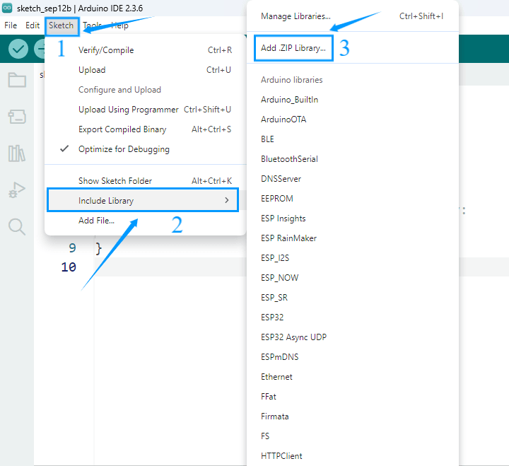
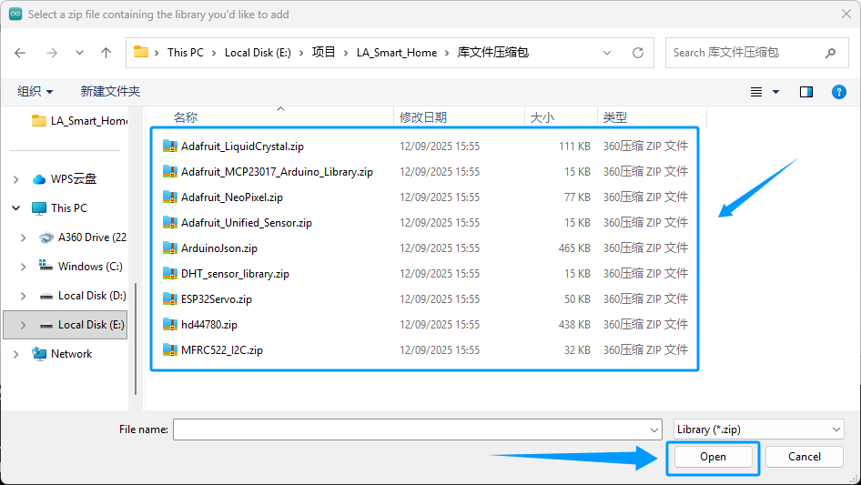
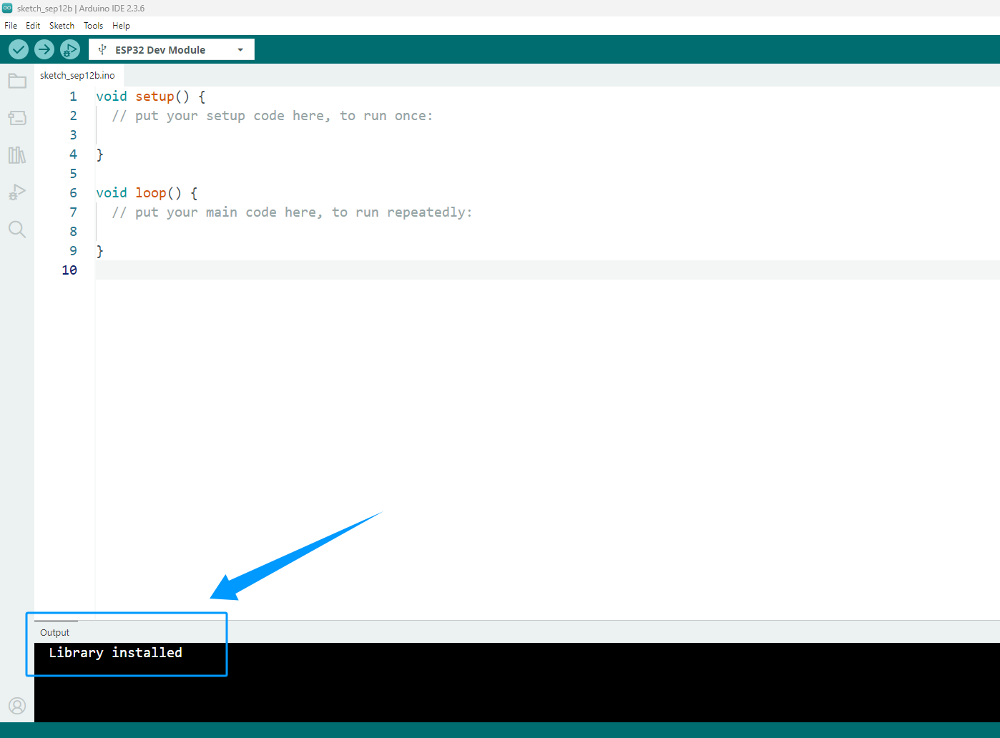
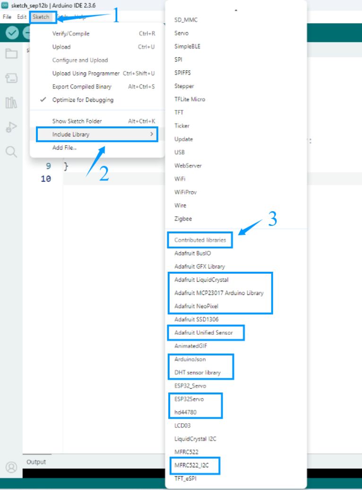

Add libraries
==============

 - Arduino libraries can significantly simplify the development process. 
 - They encapsulate commonly used functions and hardware driver code, allowing users to simply call ready-made functions without having to write complex low-level code from scratch.

 - For example, the LiquidCrystal_I2C library allows users to drive an LCD1602 display with just a few lines of code. 
 - A wealth of community-provided third-party libraries also allow for quick integration with various sensors and modules. 
These library functions make it easy to interact with hardware and expand Arduino's functionality.

Download libraries
-------------------

1. We've compiled all the libraries necessary to run this suite. Please click the link below to download them and follow the instructions to complete the installation.
`Download libraries <https://www.dropbox.com/scl/fi/j6oue7pij59qyy9cwqclh/CH34x_Install_Windows_v3_4.zip?rlkey=xttzwik1qp56naxw8v7ostmkq&e=1&st=kcy0xjl1&dl=0>`_

2. Please decompress the downloaded library file package and confirm that all the library files shown in the figure are included after decompression.

.. image:: _static/26.lib.png

Import libraries
----------------
1. Open the Arduino IDE and click "sketch" -> "Include Library" -> "Add .ZIP Library".

2. In the pop-up page, locate the storage location of the library file you just downloaded and unzipped, select the corresponding folder, and click the 'Open' button to complete the import.

3. If the library file is imported successfully, the output window of Arduino IDE will display the prompt message: ‘Library installed’

.. admonition:: Precaution
   :class: note

 - The Arduino library import function does not support multiple selections. You can only import one library at a time. Please import the required libraries one by one.
 - If you have previously imported or downloaded a library file, a prompt will pop up during the import process, as shown in the figure, asking whether to overwrite the existing library file. It is recommended to confirm the overwrite to avoid program errors caused by different library versions.

.. image:: _static/29.lib.png

3. Check whether the library file has been imported.
Click Sketch -> Include Library, scroll down to Contributed Libraries, and check whether the library files listed include the library files we provided.

Download the library file using the Arduino IDE
----------------------------------------------------------------

Using the Arduino IDE, you can download the required library files. Of course, if necessary, you can also choose to download other library files that we do not provide to meet the functional requirements of the project.

On the right side of the Arduino IDE interface, click the third icon ‘Library Manager’, enter keywords in the search box to find the required library file, and then click the ‘Install’ button to download it

.. image:: _static/32.lib.png