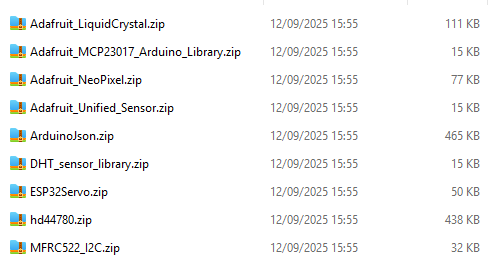
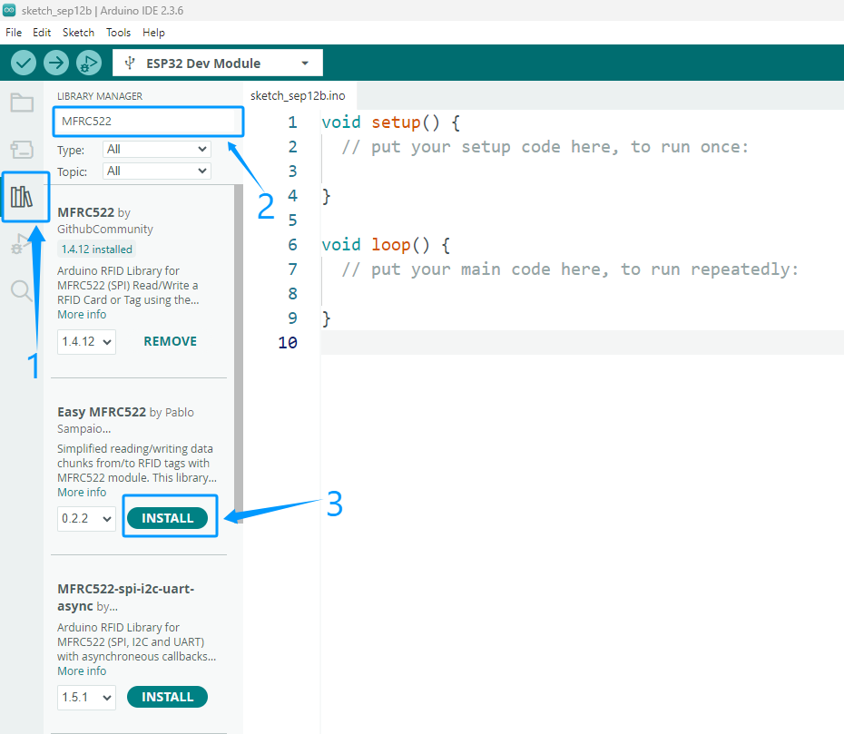

Add Libraries
==============

- Arduino libraries can significantly simplify the development process.  
- They encapsulate commonly used functions and hardware driver code, allowing users to simply call ready-made functions without writing complex low-level code from scratch.  

- For example, the **LiquidCrystal_I2C** library allows users to drive an LCD1602 display with just a few lines of code.  
- A wealth of community-provided third-party libraries also allows for quick integration with various sensors and modules.  
These library functions make it easy to interact with hardware and expand Arduino's functionality.

Download Libraries
------------------------------------

1. We've compiled all the libraries necessary to run this suite. Please click the link below to download them and follow the instructions to complete the installation:  
   `Download libraries <https://www.dropbox.com/scl/fi/j6oue7pij59qyy9cwqclh/CH34x_Install_Windows_v3_4.zip?rlkey=xttzwik1qp56naxw8v7ostmkq&e=1&st=kcy0xjl1&dl=0>`_

2. Decompress the downloaded library package and confirm that all the library files shown in the figure are included.  

Import Libraries
------------------------------------

1. Open the Arduino IDE and click **Sketch → Include Library → Add .ZIP Library**.  

   .. image:: _static/27.lib.png
      :width: 600
      :align: center

2. In the pop-up window, locate the folder of the library you just downloaded and unzipped, select it, and click **Open** to complete the import.  

   .. image:: _static/28.lib.png
      :width: 600
      :align: center

3. If the library file is imported successfully, the Arduino IDE output window will display the message: *Library installed*.  

   .. image:: _static/31.lib.png
      :width: 600
      :align: center

.. admonition:: Precaution
   :class: note

   - Arduino IDE does not support importing multiple libraries at once; you must import one library at a time.  
   - If a library file already exists, a prompt will appear asking whether to overwrite it. It is recommended to confirm overwrite to avoid program errors caused by different library versions.  

4. Verify that the library was imported successfully:  
   Click **Sketch → Include Library**, scroll down to **Contributed Libraries**, and check whether the library files we provided are listed.  

   .. image:: _static/30.lib.png
      :width: 600
      :align: center

Download Libraries Using Arduino IDE
------------------------------------

You can also download required libraries directly using the Arduino IDE.  

1. On the right side of the Arduino IDE interface, click the **Library Manager** icon.  
2. Enter keywords in the search box to find the required library and click **Install** to download.  

.. raw:: html

   

