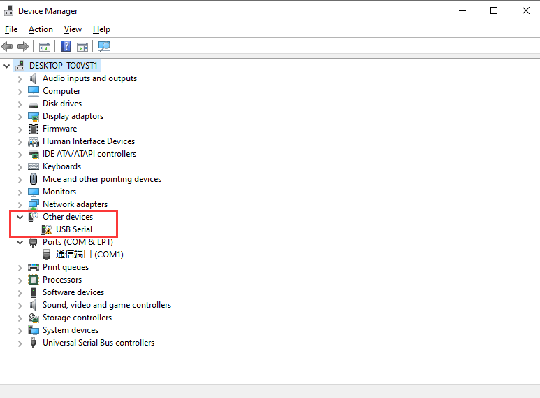
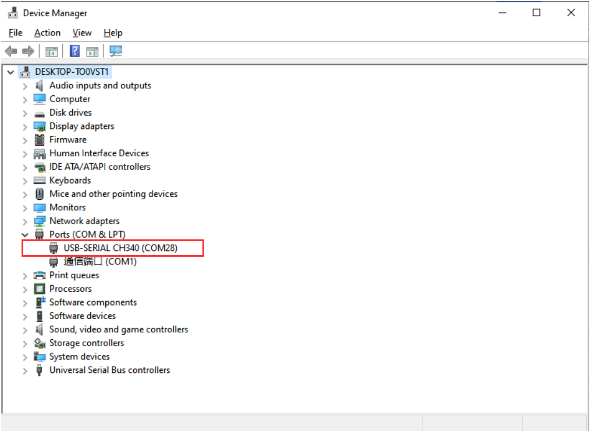
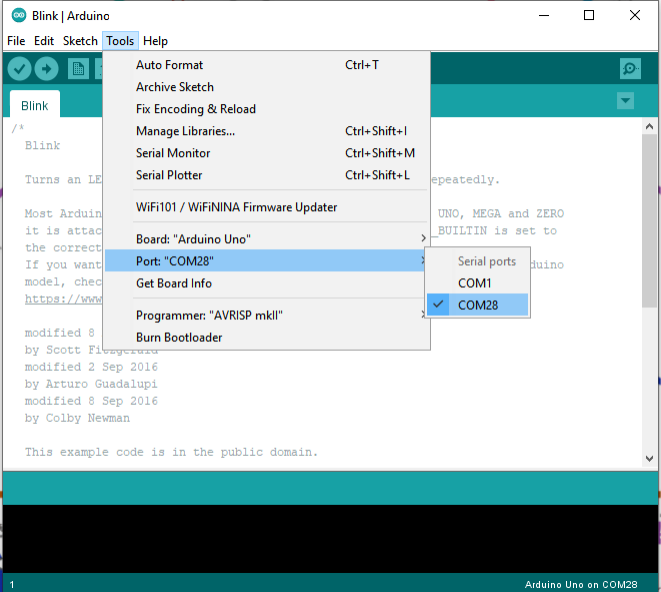

Install CH340 Driver
====================

The ESP32 development board in this kit uses the **CH340C USB-to-serial chip**, so you must install the corresponding driver before using it.  

If you connect the board to the computer without installing the driver, the device will not be recognized correctly, and you may see the following interface in the **Device Manager**:  

Downloading the Driver
---------------------

1. Visit the official website of the CH340 Driver:  
   `CH340 Driver <https://www.wch.cn/products/ch340.html>`_  

2. Select the version that matches your computer system.  
   (This tutorial uses **Windows 11** as an example.)  

   .. image:: _static/10.CH340.png
      :width: 600
      :align: center

3. Select the first Windows version, go to the download page, and click the **Download** button.  

   .. image:: _static/11.CH340.png
      :width: 600
      :align: center

4. Alternatively, you can download the prepared installation package directly:  
   `Installation Package (Windows) <https://www.dropbox.com/scl/fi/j6oue7pij59qyy9cwqclh/CH34x_Install_Windows_v3_4.zip?rlkey=xttzwik1qp56naxw8v7ostmkq&e=1&st=kcy0xjl1&dl=0>`_  

Installing the Driver
---------------------

1. After downloading, open the driver file and click **Install**.  

   .. image:: _static/13.CH340.png
      :width: 600
      :align: center

2. When the installation is successful, you will see the following confirmation message:  

   .. image:: _static/14.CH340.png
      :width: 600
      :align: center

.. note::

   In some cases, you may need to **restart Windows** after installation to ensure the driver takes effect.  

Checking Correct Driver Installation in Device Manager
-------------------------------------------------------

Once the driver is installed, connect the ESP32 board to your computer.  
You should see the correct name and port number appear in the **Device Manager** (for example: COM28).  

Checking Correct Driver Installation in Arduino IDE
----------------------------------------------------

1. Open the Arduino IDE.  
2. Go to **Tools → Port** and select the COMx port that matches the one you saw in Device Manager.  

.. raw:: html

   

   
.. note::

   If the Arduino CH340 device does not appear in Device Manager or the Arduino IDE:  
   - Uninstall the driver, restart your computer, then reinstall it.  
     .. image:: _static/17.CH340.png
        :width: 600  
   - Try a different USB port or another computer.  
   - Ensure you are using a **USB cable that supports data transfer** (not just charging).  