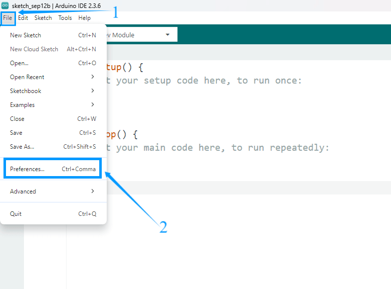
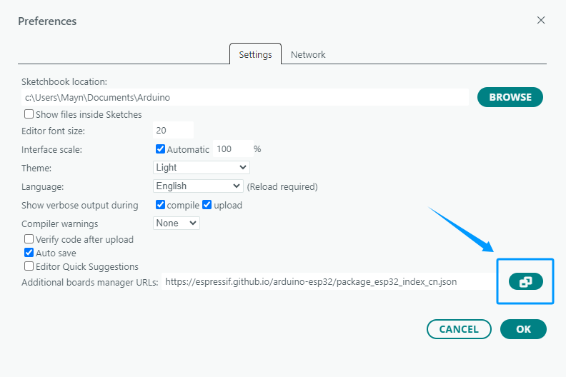
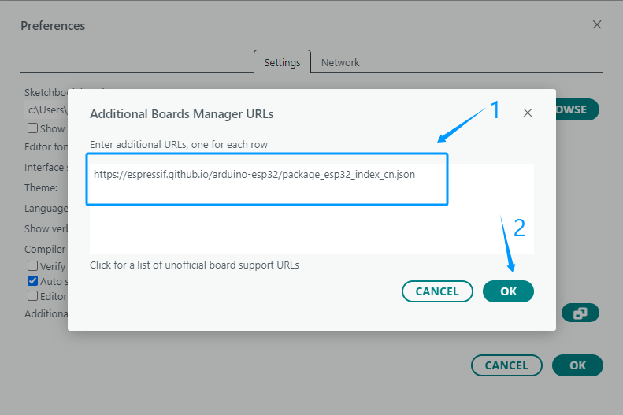

Installing The ESP32 Core Board 
================================

Add Additional Boards Manager URL
---------------------------------

1. Open the Arduino IDE, click **File → Preferences** in the upper left corner, and copy and paste the following address into the *Additional Board Manager URLs* input box.  
2. After entering the URL, click **OK**.  

.. raw:: html

   

     <code id="esp32-url" style="background:#f5f5f5;padding:6px 10px;border:1px solid #ddd;border-radius:6px;">https://espressif.github.io/arduino-esp32/package_esp32_index_cn.json</code>
     <button onclick="navigator.clipboard.writeText(document.getElementById('esp32-url').innerText)" style="padding:4px 8px;background:#007bff;color:#fff;border:none;border-radius:4px;cursor:pointer;"> Copy</button>
   

.. admonition:: Precaution
   :class: note

   - After completing this step, you need to close and reopen the Arduino IDE.

Download the Core Package for the ESP32 Development Board
---------------------------------------------------------

1. Open the Arduino IDE, click the second icon on the left to open the **BOARDS MANAGER** page.  

   .. image:: _static/21.ESP32_CORE.png
      :width: 600
      :align: center

2. Enter **ESP32** in the search box and press Enter.  

3. Find the core package titled *esp32 by Espressif Systems*, select version **3.2.0** from the drop-down menu, and click **Install** to download and install it.  

   .. image:: _static/22.ESP32_CORE.png
      :width: 600
      :align: center

4. Please wait for the download progress bar in the lower right corner to complete.  

   .. image:: _static/23.ESP32_CORE.png
      :width: 600
      :align: center

5. When the download is complete, the message **Successfully installed platform esp32:3.2.0** will be displayed.  

   .. image:: _static/24.ESP32_CORE.png
      :width: 600
      :align: center

6. Check if the installation is successful:  
Click **Tools → Board → esp32** to check whether an ESP32 development board is available for selection.  

   .. image:: _static/25.ESP32_CORE.png
      :width: 600
      :align: center

.. admonition:: Precaution
   :class: note

   - We recommend installing ESP32 Core Package version **3.2.0**, or using version **3.0 or later**.  
   - Older versions may be incompatible with the libraries used in this tutorial, causing program errors.  
   - If you have an earlier version installed, uninstall it and then reinstall version **3.2.0** of the ESP32 Core Package.  
