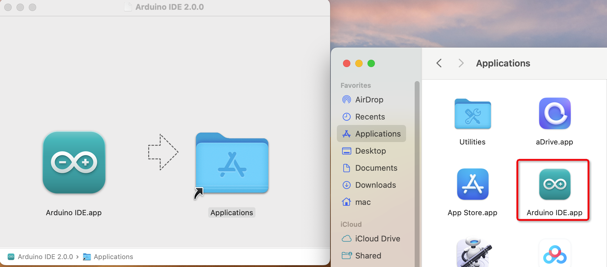

Install the Arduino IDE
===========================

Install Arduino IDE For Windows
-------------------------------

- 1. Visit the official website of Arduino IDE `Arduino IDE tutorial <https://www.arduino.cc/en/software/>`_

  .. image:: _static/2.arduino_install.png

- 2. Please select the version that matches your computer configuration to download. Click the 'Download' button to automatically start downloading.

.. admonition:: Precautions

   - The Arduino IDE version will be updated over time. To ensure compatibility with the system, it is recommended that you choose the latest official version when downloading.

- 3. Double click the ``arduino-ide_xxxx.exe`` file to run the downloaded file.
- 4. Read the License Agreement and agree it.

   .. image:: _static/3.Install_Arduino_IDE.png

- 5. Choose installation options.

   .. image:: _static/4.Install_Arduino_IDE.png

- 6. Choose install location. It is recommended that the software be installed on a drive other than the system drive.

   .. image:: _static/5.Install_Arduino_IDE.png

- 7. Then Finish. 

   .. image:: _static/6.Install_Arduino_IDE.png

Install Arduino IDE Fro MacOS
---------------------------

Double click on the downloaded ``arduino_ide_xxxx.dmg`` file and follow the 
instructions to copy the **Arduino IDE.app** to the **Applications** folder, you will see the Arduino IDE installed successfully after a few seconds.

Install Arduino IDE Fro Linux
---------------------------

For the tutorial on installing the Arduino IDE 2.0 on a Linux system, please 
refer `Linux-Install Arduino IDE <https://docs.arduino.cc/software/ide-v2/tutori
als/getting-started/ide-v2-downloading-and-installing#linux>`_

Open the IDE
-------------

When you first open Arduino IDE, it automatically installs the Arduino AVR Boards, built-in libraries, and other required files.

   .. image:: _static/8.Install_Arduino_IDE.png

In addition, your firewall or security center may pop up a few times asking you if you want to install some device driver. Please install all of them.

   .. image:: _static/9.Install_Arduino_IDE.png

Now your Arduino IDE is ready!

.. admonition:: Precautions

  - In the event that some installations didn't work due to network issues or other reasons, you can reopen the Arduino IDE and it will finish the rest of the installation. 
  - The Output window will not automatically open after all installations are complete unless you click Verify or Upload.